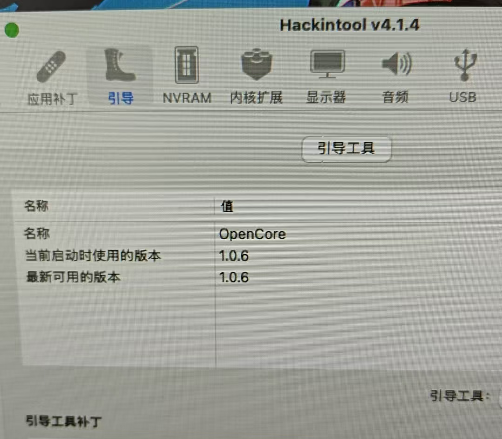
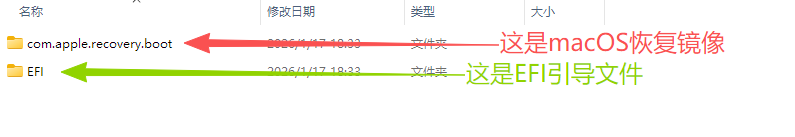
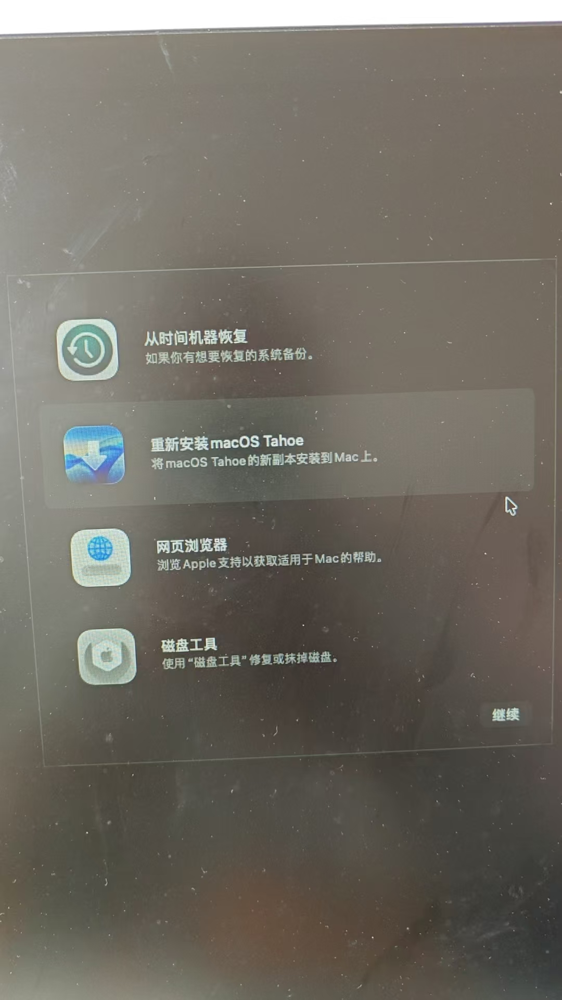
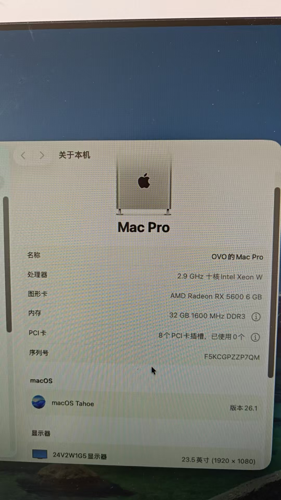

**这个是在CSDN上编辑的**[可以在CSDN上查看](https://blog.csdn.net/qq_36370910/article/details/157872086) 
***
**注意 ! 注意 ! 注意 !  虽然X99平台的CPU理论上来说基本都能用, 但显卡必须要能免驱才行,免驱名单可以直接在网上搜索**
***

**提示: 其实一些华南X99的EFI黑苹果引导文件,是有概率能直接使用的,也是可以试试别人分享的EFI文件**
**macOS Tahoe 26好像需要OpenCore1.0.6版才能安装,且低于这个版本的话,这种杂牌主板会无法识别M.2固态**



## macOS Tahoe 26版本安装方法:

建议是只下载EFI文件的压缩包(上面那个压缩包),文件比较小,至于MacOS恢复镜像文件比较大, 可以用后面介绍的方法下载,基本不限速.

如果一定要完整的两个文件的话, 我这里有个百度云盘的分享 [点击跳转到百度云盘分享:提取码: 6k5r](https://pan.baidu.com/s/1PG9LpZfPpxS4kscC1m_RJg?pwd=6k5r)

EFI文件 + MacOS恢复文件 有两个文件: 
如下图:



正常情况下, 将这两个文件, 复制到U盘根目录, 开机选U盘启动,就能正常引导.


*如果开机进bios比较困难,或不知道怎么进, 可以在开机状态下, 用cmd命令进(cmd里输入后回车)*

```bash
shutdown /r /fw /t 0
```



## MacOS其他版本安装方法:
图中第一个文件夹对应的就是MacOS指定版本的恢复镜像, 
将恢复镜像删除, 然后下载需要的MacOS版本恢复镜像(方法在下面),最后复制进来就行.


获取指定MacOS版本的恢复镜像需要你有Python环境, 然后用下面方法下载

1.获取下载MacOS恢复镜像的Python脚本

```python
curl -OL https://raw.githubusercontent.com/acidanthera/OpenCorePkg/master/Utilities/macrecovery/macrecovery.py
```
2.下载自己需要的MacOS恢复镜像的Python命令(这只是个示例模板,不要直接复制运行啊)

```python
python macrecovery.py -b Mac-2E6FAB96566FE58C -m 00000000000F25Y00 download
```
MacOS的各种版本的恢复镜像下载命令, 按自己需求下载对应版本就行
```python
Mac OS X 10.7 - Lion
./macrecovery.py -b Mac-2E6FAB96566FE58C -m 00000000000F25Y00 download
./macrecovery.py -b Mac-C3EC7CD22292981F -m 00000000000F0HM00 download

OS X 10.8 - Mountain Lion
./macrecovery.py -b Mac-7DF2A3B5E5D671ED -m 00000000000F65100 download

OS X 10.9 - Mavericks
./macrecovery.py -b Mac-F60DEB81FF30ACF6 -m 00000000000FNN100 download

OS X 10.10 - Yosemite:
./macrecovery.py -b Mac-E43C1C25D4880AD6 -m 00000000000GDVW00 download

OS X 10.11 - El Capitan
./macrecovery.py -b Mac-FFE5EF870D7BA81A -m 00000000000GQRX00 download

macOS 10.12 - Sierra
./macrecovery.py -b Mac-77F17D7DA9285301 -m 00000000000J0DX00 download

macOS 10.13 - High Sierra
./macrecovery.py -b Mac-7BA5B2D9E42DDD94 -m 00000000000J80300 download
./macrecovery.py -b Mac-BE088AF8C5EB4FA2 -m 00000000000J80300 download

macOS 10.14 - Mojave
./macrecovery.py -b Mac-7BA5B2DFE22DDD8C -m 00000000000KXPG00 download

macOS 10.15 - Catalina
./macrecovery.py -b Mac-CFF7D910A743CAAF -m 00000000000PHCD00 download
./macrecovery.py -b Mac-00BE6ED71E35EB86 -m 00000000000000000 download

macOS 11 - Big Sur
./macrecovery.py -b Mac-2BD1B31983FE1663 -m 00000000000000000 download

macOS 12 - Monterey
./macrecovery.py -b Mac-E43C1C25D4880AD6 -m 00000000000000000 download

macOS 13 - Ventura
./macrecovery.py -b Mac-B4831CEBD52A0C4C -m 00000000000000000 download

macOS 14 - Sonoma
./macrecovery.py -b Mac-827FAC58A8FDFA22 -m 00000000000000000 download

macOS 15 - Sequoia
./macrecovery.py -b Mac-7BA5B2D9E42DDD94 -m 00000000000000000 download

macOS 26 - Tahoe
./macrecovery.py -b Mac-CFF7D910A743CAAF -m 00000000000000000 -os latest download

#下面这三个不清楚
Diagnostics
./macrecovery.py -b Mac-7BA5B2D9E42DDD94 -m 00000000000000000 -diag download
./macrecovery.py -b Mac-7BA5B2D9E42DDD94 -m 00000000000JG3600 -diag download
./macrecovery.py -b Mac-7BA5B2D9E42DDD94 <real MLB> -diag download

Default version
./macrecovery.py -b Mac-7BA5B2D9E42DDD94 -m 00000000000JG3600 download       (oldest)
./macrecovery.py -b Mac-7BA5B2D9E42DDD94 -m <real MLB> -os default download  (newer)

Latest version
./macrecovery.py -b Mac-CFF7D910A743CAAF -m 00000000000000000 -os latest download
./macrecovery.py -b Mac-CFF7D910A743CAAF -m <real MLB> -os latest
```


